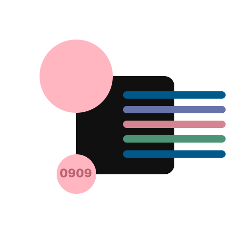
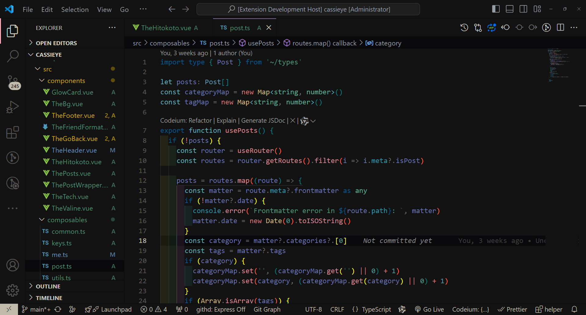
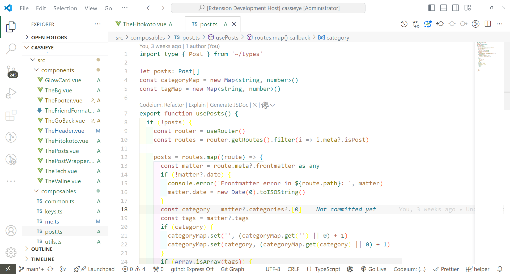

<!--
 * @Author: cassie-ye cassie20190909@gmail.com
 * @Date: 2025-03-08 20:47:57
 * @LastEditors: cassie-ye cassie20190909@gmail.com
 * @LastEditTime: 2025-03-09 16:30:01
 * @FilePath: \Cassieye-Theme\README.md
 * @Description: 这是默认设置,请设置`customMade`, 打开koroFileHeader查看配置 进行设置: https://github.com/OBKoro1/koro1FileHeader/wiki/%E9%85%8D%E7%BD%AE
-->
<h1 align="center">Cassieye Theme</h1>

<h3 align="center">
This VSCode plugin features a theme with soft and layered colors, carefully curated to offer a warm and modern palette. It aims to provide developers with a comfortable and inspiring coding environment, turning programming into a dual delight for both the eyes and the soul. 
这款VSCode插件以柔和且富有层次感的色彩为主题，精心挑选了温暖而现代的颜色组合，旨在为开发者提供一个既舒适又充满灵感的编码环境，让编程成为一种视觉与心灵的双重享受。
</h3>

## preview

### dark

> default

### light

> alpha

## end

Hope you like it!
